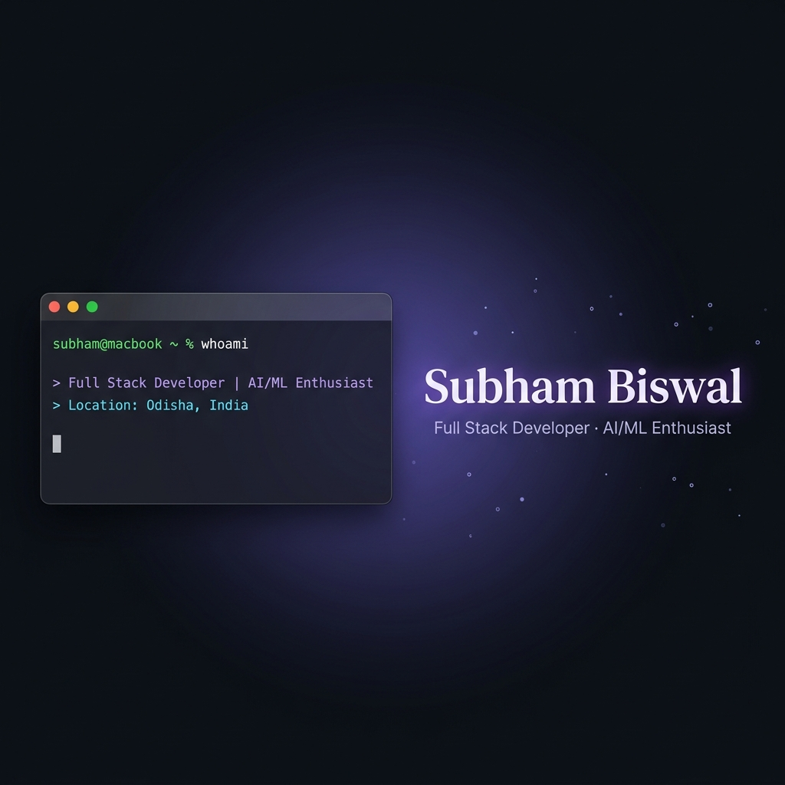

<div align="center">
  
</div>

<br/>

<div align="center">
  
  &nbsp;
  
</div>

<br/>

<div align="center">
  
</div>

<br/>

<div align="center">

[](https://biswalsubham.vercel.app/)
[](https://www.linkedin.com/in/subham-biswal/)
[](mailto:biswalsubhamrony@gmail.com)
[](https://github.com/subhambiswalrony)

</div>

---

<!--  🐍 Contribution Snake — moved to top  -->

<table width="100%">
<thead>
<tr>
<td>
&nbsp;🔴&nbsp;🟡&nbsp;🟢&nbsp;&nbsp;&nbsp;<b><code>~/subham — contributions.svg</code></b>
</td>
</tr>
</thead>
<tbody>
<tr>
<td>

<div align="center">

<picture>
  <source media="(prefers-color-scheme: dark)" srcset="https://raw.githubusercontent.com/subhambiswalrony/subhambiswalrony/output/github-contribution-grid-snake-dark.svg" />
  <source media="(prefers-color-scheme: light)" srcset="https://raw.githubusercontent.com/subhambiswalrony/subhambiswalrony/output/github-contribution-grid-snake.svg" />
  
</picture>

</div>

</td>
</tr>
</tbody>
</table>

<br/>

---

<!--  About Me  -->

<table width="100%">
<thead>
<tr>
<td>
&nbsp;🔴&nbsp;🟡&nbsp;🟢&nbsp;&nbsp;&nbsp;<b><code>~/subham — about.sh</code></b>
</td>
</tr>
</thead>
<tbody>
<tr>
<td>

```yaml
┌─────────────────────────────────────────────────────────┐
│                    subham@macbook ~                      │
├─────────────────────────────────────────────────────────┤
│  name        :  Subham Biswal                           │
│  location    :  Odisha, India 🇮🇳                        │
│  education   :  B.Tech CSE — GITA Autonomous College    │
│  role        :  Full Stack Developer | AI/ML Enthusiast  │
│  currently   :  React · AWS · System Design · AI/ML     │
│  looking_for :  Internships | SWE | AI/ML Roles         │
│  fun_fact    :  Coffee → Code · Slides → Masterpieces   │
└─────────────────────────────────────────────────────────┘
```

- 🔭 Currently building **AI-powered web apps** and **automation tools**
- 🌱 Actively learning **React**, **TailwindCSS**, **AWS**, and **Machine Learning**
- 💡 Passionate about solving real-world problems through elegant software
- 🎤 PowerPoint Specialist — selected as **PPT L1 Trainee** at Integreon
- 🎵 Hobbies: Singing and crafting impactful presentations

</td>
</tr>
</tbody>
</table>

<br/>

---

<!--  Tech Stack  -->

<table width="100%">
<thead>
<tr>
<td>
&nbsp;🔴&nbsp;🟡&nbsp;🟢&nbsp;&nbsp;&nbsp;<b><code>~/subham — skills.json</code></b>
</td>
</tr>
</thead>
<tbody>
<tr>
<td>

<div align="center">

**⚡ Frontend**


**⚙️ Backend & Languages**


**🗄️ Database & Cloud**


**🛠️ Tools & IDE**


</div>

</td>
</tr>
</tbody>
</table>

<br/>

---

<!--  Projects  -->

<table width="100%">
<thead>
<tr>
<td>
&nbsp;🔴&nbsp;🟡&nbsp;🟢&nbsp;&nbsp;&nbsp;<b><code>~/subham/projects — ls -la</code></b>
</td>
</tr>
</thead>
<tbody>
<tr>
<td>

| 🏗️ Project | 📝 Description | 🔧 Stack | 🔗 |
|:---|:---|:---|:---:|
| **🌾 AgriGPT** | AI-powered agricultural expert system giving real-time farming guidance to Indian farmers in native languages using advanced LLMs | `TypeScript` `Next.js` `AI/LLM` | [→](https://github.com/subhambiswalrony/AgriGPT-An-AI-Farmer-Intelligence) |
| **🤖 CODEC AI ChatBot** | Smart AI chatbot built with Python, Flask & TensorFlow for company info, internship details & service guidance | `Python` `Flask` `TensorFlow` `JS` | [→](https://github.com/subhambiswalrony/CODEC-AI-Powered-ChatBot) |
| **🛢️ IndianOil Chemical Portal** | Full-stack enterprise web portal for Indian Oil employees to log, manage & review daily chemical consumption ⭐15 | `TypeScript` `React` `MySQL` | [→](https://github.com/subhambiswalrony/Indian-Oil---Daily-Chemical-Consumption-Portal) |
| **📄 Java Resume Builder** | Desktop GUI app that lets users fill in their details and generate polished, formatted PDF resumes in one click | `Java` `Swing` `PDF` | [→](https://github.com/subhambiswalrony/JAVA-Resume-Builder) |

</td>
</tr>
</tbody>
</table>

<br/>

---

<!--  GitHub Stats  -->

<table width="100%">
<thead>
<tr>
<td>
&nbsp;🔴&nbsp;🟡&nbsp;🟢&nbsp;&nbsp;&nbsp;<b><code>~/subham — git stats</code></b>
</td>
</tr>
</thead>
<tbody>
<tr>
<td>

<div align="center">


<br/><br/>


</div>

</td>
</tr>
</tbody>
</table>

<br/>

---

<!--  Trophies  -->

<table width="100%">
<thead>
<tr>
<td>
&nbsp;🔴&nbsp;🟡&nbsp;🟢&nbsp;&nbsp;&nbsp;<b><code>~/subham — trophies.sh</code></b>
</td>
</tr>
</thead>
<tbody>
<tr>
<td>

<div align="center">


</div>

</td>
</tr>
</tbody>
</table>

<br/>

---

<!--  Goals  -->

<table width="100%">
<thead>
<tr>
<td>
&nbsp;🔴&nbsp;🟡&nbsp;🟢&nbsp;&nbsp;&nbsp;<b><code>~/subham — goals.sh</code></b>
</td>
</tr>
</thead>
<tbody>
<tr>
<td>

```bash
$ cat goals_2025_2026.txt

🎯 2025–2026 Roadmap:
  ├── 🔨  Build 3+ full-stack production applications
  ├── ☁️  Achieve AWS Cloud Practitioner Certification
  ├── 🤖  Deepen expertise in Machine Learning & LLM integration
  ├── 🌍  Contribute to 5+ open-source projects
  └── 💼  Secure a software engineering internship / full-time role

$ echo "Let's build something amazing together 🚀"
Let's build something amazing together 🚀
```

</td>
</tr>
</tbody>
</table>

<br/>

---

<div align="center">

### 💬 Let's Connect & Build Something Great!

*Open to internships, freelance projects, and exciting collaborations.*

<br/>

[](https://www.linkedin.com/in/subham-biswal/)
[](https://biswalsubham.vercel.app/)
[](mailto:biswalsubhamrony@gmail.com)
[](https://www.instagram.com/subhambiswal_rony/)

<br/>

*"The best code is no code at all — but when you must write it, make it count."*

⭐ **If you find my projects useful, drop a star!** ⭐


</div>
